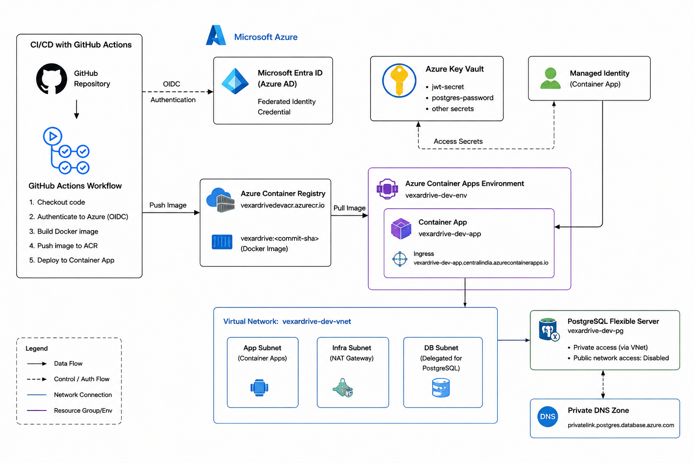

# Architecture



## Overview

The application is a containerized Node.js service deployed on Azure. Terraform manages the Azure infrastructure, while GitHub Actions builds and deploys the application image.

The design separates the application runtime, database, secrets, and CI/CD responsibilities:

* **GitHub Actions** handles build and deployment.
* **Azure Container Registry (ACR)** stores versioned application images.
* **Azure Container Apps** runs the application.
* **Azure Key Vault** stores application secrets.
* **Managed Identity** gives the Container App access to required Key Vault secrets.
* **Azure Virtual Network** provides private connectivity for the application and database.
* **Azure Database for PostgreSQL Flexible Server** provides persistent storage with public network access disabled.
* **Private DNS** provides name resolution for the private PostgreSQL configuration.

## Deployment Flow

GitHub Actions follows this flow:

1. Checkout the repository.
2. Authenticate to Azure using GitHub OIDC federation.
3. Build the Docker image.
4. Tag the image with the Git commit SHA.
5. Push the image to Azure Container Registry.
6. Update the Container App to the new image.

Using the commit SHA as the image tag makes each deployment traceable to a specific source revision instead of relying only on a mutable `latest` tag.

## Application and Database Flow

The application runs in Azure Container Apps and connects to PostgreSQL through the private Azure network configuration.

PostgreSQL is configured with public network access disabled. It uses a delegated PostgreSQL subnet and private DNS configuration, so the database does not need to be exposed to the public internet.

This keeps the database as an internal dependency of the application rather than a publicly reachable service.

## Secrets and Identity

Database credentials and the JWT secret were originally present in application configuration. They were moved to environment-based configuration and, for the Azure deployment, stored in Azure Key Vault.

The Container App uses a managed identity to access the required Key Vault secrets. This avoids putting database credentials or Azure credentials directly into the container image.

GitHub Actions separately uses OIDC federation to authenticate to Azure. This avoids storing a long-lived Azure client secret in GitHub Actions.

## Key Design Decisions

### Container Apps

The application is packaged as a Docker image and deployed to Azure Container Apps. For this workload, this avoids managing application VMs or a separate Kubernetes cluster while still providing a managed container runtime.

### Private PostgreSQL

PostgreSQL Flexible Server has:

```text
public_network_access_enabled = false
```

The server is connected through the PostgreSQL delegated subnet and private DNS configuration.

The decision was made because the application has no requirement for PostgreSQL to be publicly reachable.

### ACR as the Image Boundary

The deployment pipeline separates image creation from application execution:

```text
Source → Docker image → ACR → Container App
```

ACR provides a persistent registry for the image, while Container Apps consumes the image during deployment.

### Commit-Based Image Tags

Images are tagged using the Git commit SHA. This makes a deployed container directly traceable to the source revision that produced it and avoids making `latest` the only deployment reference.

### Managed Identity for Key Vault

The Container App uses its managed identity for Key Vault access. Access is controlled by Azure RBAC rather than embedding another credential inside the application.

### Database Connection Pooling

The original `/api/fleet/ping` implementation created a new PostgreSQL connection for every request. This was changed to use a connection pool.

Pooling avoids repeatedly establishing database connections and is more appropriate for a frequently called endpoint.

## Application-Level Changes Reflected by the Architecture

The infrastructure work was combined with several application changes identified during the assessment:

* Database host, port, username, password, database name, and JWT secret are configurable instead of hardcoded.
* The login query uses a parameterized SQL query instead of concatenating the phone number.
* `/api/admin/drivers` requires JWT authentication and an admin role.
* The admin endpoint has database error handling.
* Fleet ping request data has basic validation.
* Database failures in the login path are handled instead of being allowed to terminate the Node.js process.
* A role column was added to drivers and the test driver was assigned the admin role.

These changes address the highest-impact issues found during the application review while keeping the implementation within the scope of the assessment.

## Local Development

Docker Compose was also corrected to reflect the actual application/database relationship:

* The application uses the Compose `db` service as its database hostname.
* Database credentials are supplied through environment variables.
* PostgreSQL host port exposure was removed because the application communicates with PostgreSQL over the Compose network.
* PostgreSQL has a healthcheck.
* Application startup waits for PostgreSQL to become healthy.

This makes the local environment consistent with the application's containerized deployment model.

## Known Limitation

OTP verification is not implemented.

The starter repository accepts an OTP but does not provide an OTP provider or OTP-storage mechanism with which the submitted value can be verified. Implementing real verification would therefore require an additional provider/storage design.

This is left explicitly as a known limitation rather than pretending that accepting any OTP provides authentication security.

## Architecture Summary

The resulting architecture is intentionally small and focused on the requirements identified during the assessment:

* private database connectivity
* externalized secrets
* managed identity for workload access
* OIDC-based CI/CD authentication
* reproducible container deployments
* database connection reuse
* SQL injection prevention
* authenticated admin access
* reliable database error handling

Terraform is responsible for the Azure infrastructure, while GitHub Actions is responsible for building and deploying application artifacts.